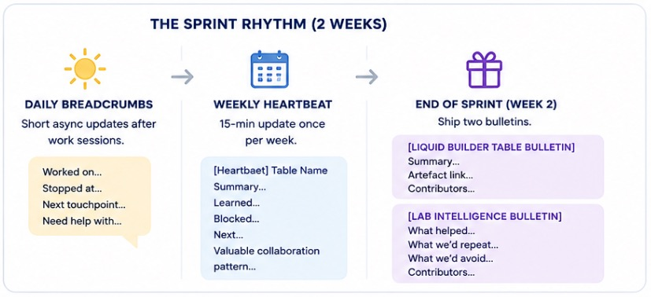
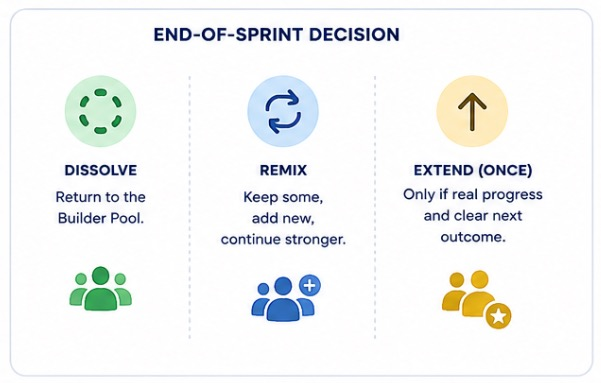

# Agentic Lab

Agentic Lab is a continous team system for AI practitioners to find commited work buddies to overcome shared blockers, help complete visible work, and successfully small shipped artefacts.

Teams are formed for a 2-week period. After that period teams are free to disband, continue, renew, or remix.

**Current status: v1.0**

Currently, we are building a new team of 3–5 serious builders.

Already Interested? [Request an invite](mailto:....)

## Who This Is For

The Agentic Lab is for people who:

- are working on a real AI-related challenge
- need commited work buddies or sparring partners
- want to build trust and connection through work and collaboration
- are commited to contribute regularly
- can share progress openly

## Expected goals

Meetings during the two week cycle focus on

Allowed:

- ✅ serious questions
- ✅ unfinished work
- ✅ technical blockers
- ✅ failure reports
- ✅ rough prototypes
- ✅ tool comparisons
- ✅ real operational lessons

Not allowed:

- ❌ product promotion
- ❌ vague AI hype
- ❌ passive lurking inside active tables
- ❌ private cold-DM extraction
- ❌ endless discussion without output
- ❌ tables continuing without a concrete next outcome
- ❌ inactive members

## How it works

Agentic Lab runs on **Team Tables**.

A Team Table is a temporary 2-week squad of 3–5 people working on one concrete AI-related challenge.

Tables dissolve by default after 2 weeks unless there is a clear reason to renew or remix.

This keeps the system fresh, avoids cliques, and makes it safe to test different working constellations and voucher new valuable connections.

Most importantly this is **voluntary, committed, and free**.



### Table Rhythm

Team Tables run on a simple two-week rhythm:

1. **Progress Signals** — optional individual updates during the week
2. **Table Pulse** — mandatory weekly collective check-in
3. **Sprint Artefact** — mandatory output at the end of the two-week sprint

The goal is to keep work visible, keep the table alive, and produce something useful with the least amount of admin and control.

---

### 1. Progress Signals

Progress Signals are encouraged whenever they help the table coordinate.

They are **not mandatory** and they are **not daily homework**.

Use them after meaningful work sessions, discoveries, blockers, tests, or decisions.

Format:

```text
Worked on:
Found / learned:
Next step:
Need input on:
```

Example:

```text
Worked on:
Testing the Hermes agent setup.

Found / learned:
Docker is too rigid for the current exploration phase. Every new ecosystem extension, dependency, or Hermes update creates rebuild overhead instead of helping me work with the agent.

Next step:
Use a virtual machine setup with snapshots, so experiments can move faster and failures are easy to roll back.

Need input on:
Has anyone found a low-friction way to run fast-changing agent stacks in Docker, or are VM snapshots the better exploration setup?
```


Progress Signals make useful work visible while it is happening.

---

### 2. Weekly Table Pulse

Once per week, each active table posts **one collective Table Pulse**.

This is the minimum communication commitment for being part of an active table.

The Table Pulse answers:

> Is this table alive, moving, blocked, or producing something useful?

Recommended timing:

* once per week
* posted by Saturday 21:00
* written by the table host or any active participant

Format:

```text
[Table Pulse] Table Name — Week 1

What moved forward:
What was learned:
What is blocked:
Next focus:
Useful collaboration pattern:
```

The “Useful collaboration pattern” captures process lessons that help future tables work better.

---

### 3. Sprint Artefact

At the end of the two-week sprint, a table produces one small artefact.

This is the proof that the table created value.

Examples:

* short demo
* GitHub repo
* architecture sketch
* written insight
* comparison table
* workflow
* prompt pack
* lessons learned post
* public or internal bulletin entry

The artefact does not need to be polished. It needs to make the table’s learning visible and reusable.

Format:

```text
[Sprint Artefact] Table Name

Outcome:
What we built / learned:
Most useful insight:
What others can reuse:
Next possible direction:
```

A table that has no pulse and no artefact is not active. It is just a chat.


## End-of-Sprint Decision



Every table chooses one path.

### Dissolve

Default option.

Everyone returns to the Builder Pool.

### Remix

Some people continue, some leave, new people join.

This is the preferred default for healthy tables.

### Extend

Only extend if:

- real progress happened
- the next outcome is clear
- the same group still has strong urgency

Long-running private teams are not the goal. The liquid builder table works because people keep remixing and making new connections for future endeavours.

### Inactive participants

Team Tables are for active participants. A participant is active when they contribute to the table outcome through visible work, useful feedback, blocker removal, research, testing, documentation, or implementation.

Inactive participants will automatically be rotated into a Discovery Track, giving other committed builders the space to be effective.

The minimum commitment is:

* contribute during the sprint
* post the Weekly Table Pulse
* help produce the Sprint Artefact

If someone goes quiet for one week without contributing or posting the Weekly Table Pulse, they simply move back to the Discovery Track / Builder Pool.

The table stays active. The person can join another later table when timing fits better for them.

## Next Steps

Already Interested? [Request an invite](mailto:....)
