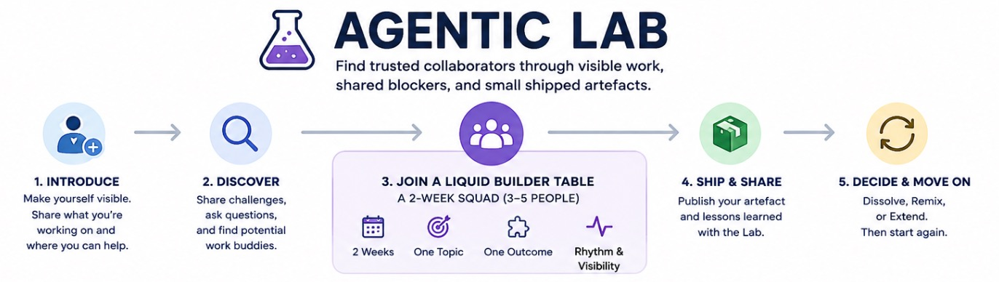

# Agentic Lab

Agentic Lab is a lightweight builder system for people working in or entering AI who need serious work buddies, not passive networking.

The goal is simple:

> Find trusted collaborators through visible work, shared blockers, and small shipped artefacts.

This is not a course, a networking lounge, or a promotion channel. It is for people with real AI-related challenges who are willing to show up, work, learn, and help others move faster.

## Core Idea

Agentic Lab runs on **Liquid Builder Tables**.

A Liquid Builder Table is a temporary 2-week squad of 3–5 people working on one concrete AI-related challenge.

Every table dissolves by default after 2 weeks unless there is a clear reason to renew or remix.

This keeps the system fresh, avoids cliques, and makes it safe to test different working constellations and voucher new valuable connections.


## Who This Is For

Agentic Lab is for people who:

- are working on a real AI-related challenge
- need competent work buddies or sparring partners
- are willing to contribute during the week
- can share progress openly
- want to build trust and connection through work, not small talk

It is not for people who only want to observe, promote products, collect contacts, or casually discuss AI hype.

## Tracks

### 1. Welcome / Introductions

This is the first step to visibility in the lab.

Introduce yourself briefly so others can understand what you are working on, where you can help, and where there may be useful overlap.

Use this format:

```text
Name / role:
What I am building, testing, or exploring:
Relevant skills / background:
What I can help with:
What I am looking for:
Link, if useful:
```

---

### 2. Discovery Track

The Open Track is the entry layer.

Use it to:

- share your current AI-related challenge
- ask serious questions
- discover possible work buddies
- apply to Liquid Builder Tables

Weekly prompt:

```text
Current challenge:
Context:
What I tried:
Where I need help:
```

Rules:

- no product promotion
- no vague or essoteric AI hype
- no cold DMs public channel only
- actual high priprity work challenges only

---

### 3. Liquid Builder Tables

Liquid Builder Tables are short, focused work squads.

Fixed structure:

- **Length:** 2 weeks
- **Size:** 3–5 people
- **Topic:** one clear topic
- **Outcome:** one concrete output
- **Rhythm:** breadcrumbs + heartbeat + final artefact
- **End state:** dissolve, remix, or extend

Only join a table if the topic matters enough that you would work on it anyway.


## Topic Proposal

Every table starts with a simple proposal:

```text
Topic name:
Concrete 2-week outcome:
Why this matters:
Useful skills:
```

Example:

```text
Topic name:
Agentic browser workflow for research tasks

Concrete 2-week outcome:
A working prototype that opens a page, extracts structured findings, and logs results.

Why this matters:
Many AI workflows break when they need reliable browser interaction.

Useful skills:
Python, browser automation, Docker, API design, prompt/workflow design.
```

Keep proposals concrete. A table without a clear outcome should not start.


## Sprint Rhythm


### 1. Daily Breadcrumbs

No daily standups. No corporate reporting. Daily breadcrumbs are mandatory for participants to keep pulse of Liquid Builder Table.

After a work session, drop a short update in the table channel:

```text
Worked on:
Stopped at:
Next touchpoint:
Need help with:
```

Example:

```text
Worked on:
Docker setup for the browser agent.

Stopped at:
Container starts, but VNC does not expose the session correctly.

Next touchpoint:
Check compose networking and port mapping.

Need help with:
Anyone who has run browser automation in Docker with visible VNC.
```

Breadcrumbs create visibility and prevent people from working in silos.


### 2. Weekly Heartbeat

Each table posts one short heartbeat per week.

Purpose:

> Is the table alive, learning, blocked, or producing something useful?

Recommended timing:

- once per week
- 15 minutes
- same time each week
- written update posted by Friday 21:00

Heartbeat format:

```text
[Heartbeat] Table Name — Week 1

Summary Week activity:
Learned:
Blocked:
Next:
Valuable collaboration pattern:
```

For the ***Valuable collaboration pattern*** That is where the lab creates shared intelligence beyond individual projects, which helps us make even better tables.


## Sprint End

At the end of 2 weeks, every table publishes two short bulletins.

### 1. Liquid Builder Table Bulletin

```text
[Liquid Builder Table Bulletin]

Table:
Summary:
Artefact link:
Contributors:
```

The artefact can be:

- demo
- GitHub repo
- Notion doc
- architecture sketch
- prompt set
- workflow
- failure report
- comparison
- short video
- and more ...

Any format is fine. Empty talk is not.


### 2. Lab Intelligence Bulletin

```text
[Lab Intelligence Bulletin]

What helped us move faster:
What we would repeat:
What we would avoid:
Contributors:
```

This captures process lessons that help future tables work better.


## End-of-Sprint Decision


Every table chooses one path.

### Dissolve

Default option.

Everyone returns to the Builder Pool.

### Remix

Some people continue, some leave, new people join.

This is the preferred default for healthy tables.

### Extend

Allowed once only.

Only extend if:

- real progress happened
- the next outcome is clear
- the same group still has strong urgency

Long-running private teams are not the goal. The liquid builder table works because people keep remixing and making new connections for future endeavours.


## Minimum Operating Calendar

```text
Monday:
Topics open / tables form

Tuesday–Thursday:
Table work + breadcrumbs

Friday:
Heartbeat due by 21:00

End of Week 2:
Show & Tell + bulletins + dissolve/remix/extend
```

Keep the timing boring. Boring timing makes the system usable.


## Guardrails

Allowed:

- serious questions
- unfinished work
- technical blockers
- failure reports
- rough prototypes
- tool comparisons
- real operational lessons

Not allowed:

- product promotion
- vague AI hype
- passive lurking inside active tables
- private cold-DM extraction
- endless discussion without output
- tables continuing without a concrete next outcome


## One-Line Summary

Agentic Lab is a continous 2-week remixable builder team system for serious AI practitioners to find trusted work buddies through visible work, shared blockers, and small shipped artefacts.